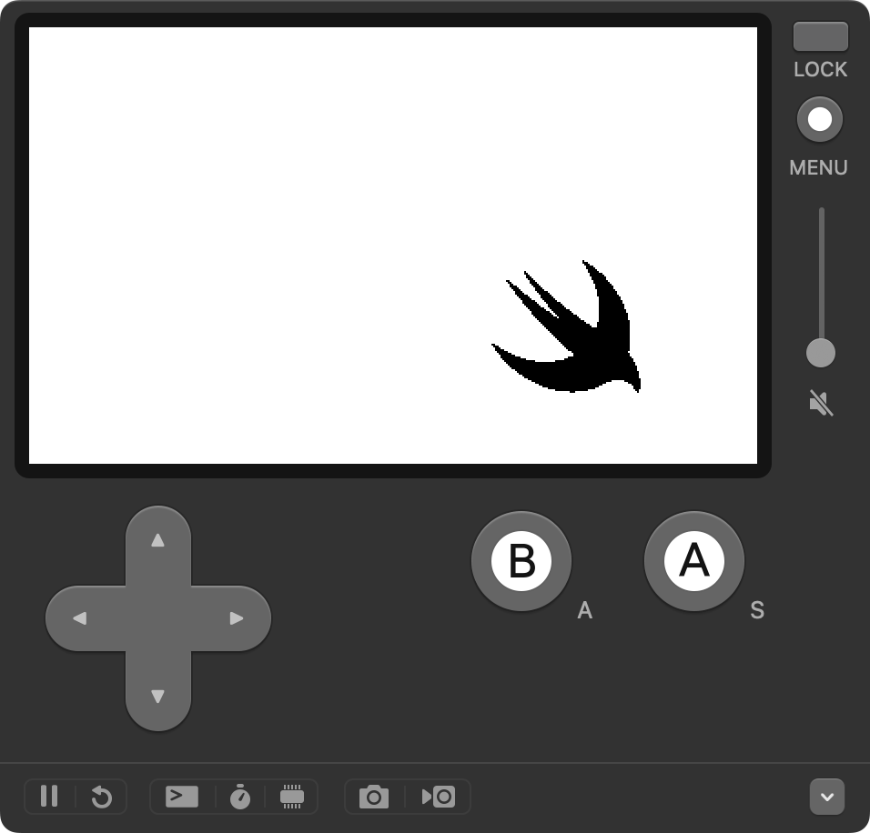

<div class="doc-header">
  <h1>「小さなアプリバイナリを構築する」で使用したサンプルコードをビルドする</h1>
  <div class="doc-author">栗山徹(kotetu/kotetuco)</div>
</div>
</div>

「小さなアプリバイナリを構築する」で使用したサンプルコードをビルドする
==

<!-- Qiita用 
:::note info
本記事は [技術書典16](https://techbookfest.org/event/tbf16) で無料配布する同人誌「ゆめみ大技林 '24」の寄稿です。加筆や修正などがある場合はこの記事で行います。
:::
-->

## はじめに

### "Playdate"で動作するアプリをSwiftで実装することの衝撃

"try! Swift 2024" [^1]で発表された "小さなアプリバイナリを構築する" [^2] は、筆者にとって興味深い内容でした。

まずはバイナリサイズを削減する目的を明示し、 Swift 言語のコンパイルプロセスを解説しながら、コンパイルプロセス中に行われる3種類の最適化フェーズが紹介されました。後半では、普段のアプリ開発でサイズに配慮したコードを書く方法が解説され、バイナリサイズのボトルネックを測定する方法や未使用コードの削減の重要性について紹介されました。発表は、実用的なノウハウだけでなく、 Swift のコンパイルプロセスといったディープな内容も含んだ興味深い内容でした。

<!--
未採用の文章の断片(一通り書き上がったら消す)

現在のアプリ開発において、バイナリサイズに気を遣う機会は減りましたが、App Clip など一部の機能においてはバイナリサイズに制約があるほか、非Wi-Fi環境ではサイズが大きいアプリはインストールを躊躇されるリスクがあるため、全く気にしなくても良い話ではありません。
-->

ただ、筆者が最も衝撃を感じたのは、発表の終盤で取り上げられた内容でした。その内容とは、"Playdate" [^3]という、 Panic 社が販売している携帯ゲーム機上で動作するアプリを Swift を使って実装する、というものでした。

筆者はこれまで、組み込みデバイスや携帯ゲーム機向けのアプリケーション開発において、 Swift が使われることはまずないだろうとずっと考えてきました。組み込み向けに使われるのは今でも C/C++ が多く [^4]、組み込み機器向けの開発については、 Swift のコミュニティではあまり議論されていないものと思い込んでいました。

それが、現在では Embedded Swift [^5]といった、組み込み機器向けに Swift 言語を使用するためのプロジェクトなどが発足したりと、組み込み分野における Swift の可能性を模索する動きが活発になっていました。

これまで、 C言語や Rust を使って OS 無しで動作するコードを書いたりしたことはありましたが、 Swift の言語機能を使って組み込み機器を開発できるかもしれないということに、普段仕事で Swift を書いている筆者としては大きな期待感を持ちました。

[^1]: https://tryswift.jp/

[^2]: https://speakerdeck.com/kateinoigakukun/building-a-smaller-app-binary

[^3]: https://play.date/

[^4]: 最近では、Rustなどが使われるケースも出てきました。

[^5]: https://www.swift.org/blog/embedded-swift-examples/

### サンプルコードが動くようになるまでに一苦労

筆者も手元で動かしてみたいと思い、発表で紹介されていたサンプルコード[^6]を Clone してビルドしようとしましたが、これが一筋縄ではいきませんでした。

最も難しいのは Swift Package Manager (以後、**SwiftPM**) を修正してビルドするところでしたが、それ以外にもいくつかハマりどころがありました。 Swift コンパイラへ普段から Contribute している方であればそこまでハマらないだろう箇所に初心者の筆者は様々な箇所でハマり込んでしまいました。

そんな悪戦苦闘を記録に残すことで、これから筆者と同様に Playdate や Embedded Swift に興味を持った方が少しでもスタートラインに立つことができるようなるかもしれない、と思い立ったことが本稿を執筆しようと思ったきっかけです。

[^6]: https://github.com/kateinoigakukun/swift-playdate

### 本稿の目的と対象読者

本稿では、 "小さなアプリバイナリを構築する" で紹介されたサンプルコードである、 kateinoigakukun/swift-playdate リポジトリ(以後、 **swift-playdateリポジトリ** と記載)のコードをビルドして Playdate のエミュレータでビルドしたプログラムが動作するまでの手順を解説します。

筆者と同様に、 Swift の処理系や組み込み向けの Swift について詳しくない方でも、エミュレータ上でサンプルアプリを動作できる(**図1**)ような内容となっています。



また、 SwiftPM の修正については、Swift コンパイラをビルドする手順が解説されていることから、これから Swift コンパイラへ Contribute しようという方にとっても有用な内容となっています。

なお、本稿では macOS を用いてビルドを行っています。 Linux や Windows 環境でビルドを行う場合は、ダウンロードする Snapshot や 一部設定が異なります。

## サンプルコードをビルドできるまでの全記録

### 概要 〜 まずは全容を把握する

swift-playdate リポジトリをビルドするためには、 README.md に記載されている手順を実行するための下準備が必要です。下準備も含めて、実施しないといけない手順は次のとおりです。

1. Trunk Development の snapshot をインストールする
2. Playdate SDK をインストールする
3. swift-playdate リポジトリを Clone する
4. build.sh を編集する
5. playdate-ld を編集する
6. SwiftPM を修正してビルドする
7. 修正した SwiftPM が含まれる Swift の Toolchain をインストールする
8. build.sh を実行してビルドする

"1. Trunk Development の snapshot をインストールする" と "2. Playdate SDK をインストールする" については、"Swift Playdate Examples" というドキュメントのチュートリアル[^7]でスクリーンショット付きで詳しく解説されているため、本稿の解説を読み飛ばすことも可能です。

[^7]: https://apple.github.io/swift-playdate-examples/documentation/playdate/downloadingthetools/

### 1. Trunk Development の snapshot をインストールする

まずは、ビルドに必要な Swift をダウンロードします。 Playdate 用のアプリをはじめとする組み込み機器向けの機能は Experimental (実験的)な機能となるため、 Xcode に含まれる Swift の Toolchain ではビルドすることができません。Experimental な機能が使用可能な Swift の Toolchain は **https://www.swift.org/download/#snapshots** からダウンロードすることができます。今回は **Trunk Development (main)** と記載された Snapshot を使用します。

macOS でビルドを行う場合は Xcode と記載された行のリンク先から.pkgファイルをダウンロードします。ダウンロードが完了したら、画面の指示に従ってインストールを行ないます。基本的には画面の指示に従ってインストールを進めれば問題なくインストールできるはずですが、"インストール先の選択" において "このコンピュータのすべてのユーザ用にインストール" を選ぶか "自分専用にインストール" を選ぶかでインストール先が異なる点に注意が必要です。後の手順で、インストール先のToolchainの内容を調べてる必要があるため、この時にどちらを選択したかについては覚えておいてください。

インストールが完了したら、 Toolchain 一式がローカルにインストールされます。"このコンピュータのすべてのユーザ用にインストール" を選んだ場合は `/Library/Developer/Toolchains` にインストールされ、  "自分専用にインストール" を選んだ場合は `$HOME/Library/Developer/Toolchains` にインストールされます。

### 2. Playdate SDK をインストールする

次に、Playdate のサイトから SDK をダウンロードし、ローカルへインストールします。 https://play.date/dev/ から macOS の場合は .pkg ファイルをダウンロードし、インストールします。

インストールが成功すると、 `$HOME/Developer/PlaydateSDK` に必要なファイル一式が生成されていることがわかります。

### 3. swift-playdate リポジトリを Clone する

以下のコマンドで swift-playdate リポジトリを Clone します。

```shell
git clone https://github.com/kateinoigakukun/swift-playdate.git
```

Clone したら、 `swift-playdate` という名称のディレクトリができているはずです。

#### ディレクトリ内のファイル構成について

ディレクトリ内のファイルは、大きく分けて次の様な構成になっています。

- Examples
  - サンプルアプリの処理が含まれています。 Swift ロゴの描画や移動のロジック、画像リソースが含まれています。ビルドスクリプトである build.sh もこちらのディレクトリに含まれます。
- Sources
  - 共通処理が含まれます。
- SwiftSDKs/Playdate.artifactbundle
  - Playdate 用 SDK 周りのコンパイルと Swift コードとのリンクを行うためのシェルスクリプトが含まれます。
- Package.swift
  - サンプルアプリのビルドで使用する、 Experimental 機能を有効にするための設定が含まれます。

#### Examples/build.sh を実行してみる

さて、ここまでの手順が終わった段階で、一度 build.sh を実行してみましょう。ターミナルで以下のコマンドを実行してください。

```shell
cd swift-playdate/Examles
./build.sh
```

実行すると、早々に下記の様なエラーが出力されるはずです。

```shell
./build.sh
+ export TOOLCHAINS=org.swift.59202403011a
+ TOOLCHAINS=org.swift.59202403011a
+ swift-build --product Example --experimental-swift-sdk playdate -c release
./build.sh: line 7: swift-build: command not found
```

"swift-build: command not found" と出力されていることがわかるはずです。1. の手順で Toolchain をインストールしたはずなのに、 swift-build コマンドが見つからないのはなぜでしょう？

実は、 build.sh の `export TOOLCHAINS=org.swift.59202403011a` という設定に秘密があります。 **TOOLCHAINS** は環境変数の一種で、利用する Toolchain を切り替えるために利用されます。 "org.swift.59202403011a" という文字列は、各 Toolchain 直下にある Info.plist 内の `CFBundleIdentifier` に記載されている ID のことです。よって、 TOOLCHAINS には、利用したい Toolchain の CFBundleIdentifier を指定する必要があります。

swift-playdate リポジトリの README.md には、 

```
1. Install swift-DEVELOPMENT-SNAPSHOT-2024-03-01-a toolchain from Swift.org
```

という記載があります。つまり、 build.sh の TOOLCHAINS で設定されているのは、上記バージョンの Toolchain の CFBundleIdentifier 値ということになりますので、上記とは異なるバージョンを利用する場合はこの TOOLCHAINS を書き換えなければなりません[^8]。

[^8]: 2024/04/14 現在、swift.org でダウンロード可能な Trunk Development (main) で最も古いバージョンは 2024/03/30 のバージョンになるため、README.md に記載されているバージョンはダウンロードできません。従って、 build.sh の TOOLCHAINS は必ず変更が必要になります。

### 4. build.sh を編集する

### 5. playdate-ld を編集する

### 6. SwiftPM を修正してビルドする

### 7. 修正した SwiftPM が含まれる Swift の Toolchain をインストールする

### 8. build.sh を実行してビルドする

#### build.sh の中で何を行っているのか？

## (時間と紙面の都合が合えば) Swift コードについて解説

## おわりに
